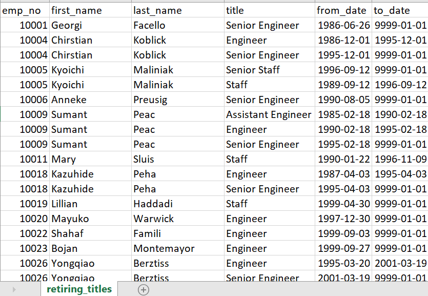
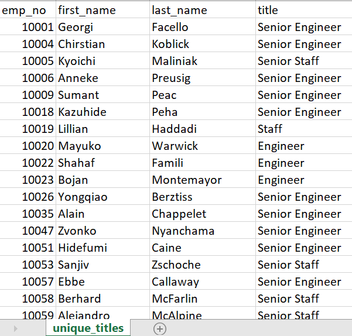
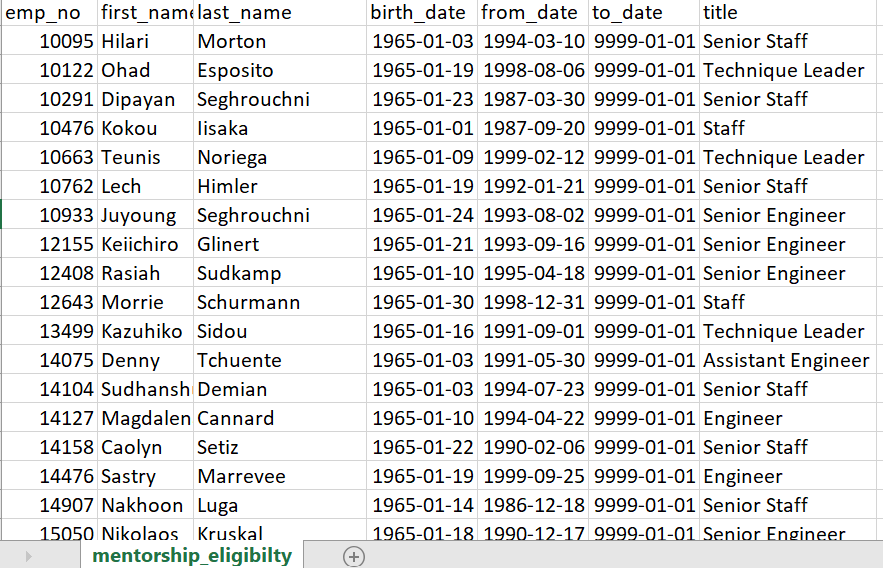

# Pewlett-Hackard-Analysis
Analysis of Pwelett Hackard employee database
## Overview of the analysis
Purpose of the analysis is to find out number of employees from specific department and with specific titles in Pewlett Hackard company who are about to get retire with their unique data like employee number or department number to start filling those empty spaces with new hiring. 

## Results

- From above image, top management / HR of the company can find out how many employees with their title are about to get retired in some time, only constraint with this data is it includes all the titles of employees that they must have acquired during their course of employment in Pewlett Hackard.

- Unique titles csv file shows the employees unique title with their first and last name which can help Human resource and top management department to track employees with job title retiring. This will result in creating plan to hire those many employees to fill the gaps. 

- Analysis towards the mentorship eligibility database results in employees data hired between January 1st to December 31st 1965 and who need mentorship guidance to improve performance of Pewlett Hackard company. 
- This overall analysis guide management to plan out job employment opportunities for new candidates in particular roles which can help to keep a balace productivity also to take measures towards improving performance. 

## Summary
--Additional query and table
-- Employee count by department name
SELECT dept_name, COUNT(emp_no) AS retiring_count
INTO dept_retiring_count
FROM dept_info
GROUP BY dept_name
ORDER BY retiring_count DESC;
-- Mentorship Eligible retiring employees by titles
SELECT title, COUNT(emp_no) AS title_count
INTO title_mentorship_count
FROM mentorship_eligibilty
GROUP BY title
ORDER BY title_count DESC;
Above code shows that there are enough qualified employees for mentoring next generation employees at Pewlett Hackard company. 
